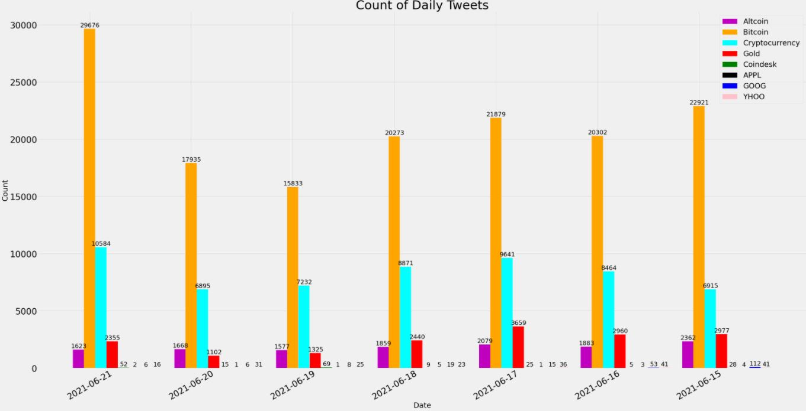
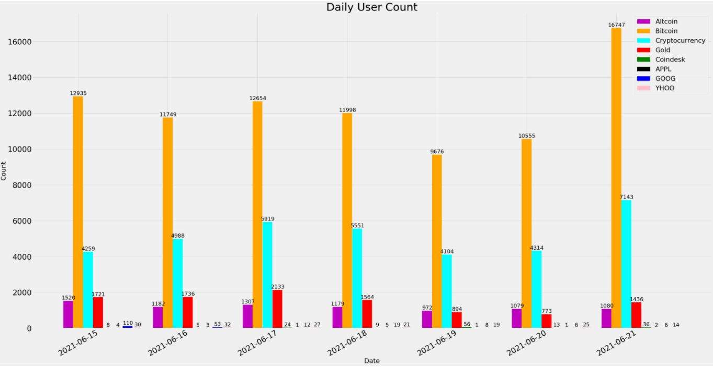

# Twitter-Data-Analysis
This project aims at scraping Twitter data relating to stock market and analyzing the data. 
Below are the objectives of the project:
1) Gain experience of collecting data from Twitter using Twitter API 
2) Gain experience of data storage to store the data and query 
3) Gain experience of collecting real-time data 
4) Gain experience of data cleaning and data visualization

## Output

